# Quest

Quest is a Hillfort Explorer App powered by Kotlin.

### Assignment Specification
* Splash Screen
* Login / Sign up / Log out
  * Email
  * Password
* Quest Create / Update / Delete 
  * Name
  * Description
  * Up to 4 images
  * Location (lat/long)
  * Visited
  * Date
  * Notes
* Quest List 
* Settings
  * Total Number of Quests
  * Number of Quests Visited
* Navigation Drawer
* Unified JSON (users, quests)
* Commit History, Tagged Releases, Branching

### v1.0
* Quest List 
* Quest Update / Create / Cancel
  * Name
  * Description
  * 1 Image
  * Location (lat/long)
  * Notes
  * Visited
  * Date
  * Rating
* Toolbar: Home, Create, List, Settings

#### Additional features
* Rating
* Townland
* Country
* Text input label float on top of text
* Google icons

    
    
    
    
    

### v2.0
* Navigation Drawer
* Delete Quest
* Splash Screen

#### Additional features
* Up / Down Quest transition in edit mode
* Remove text field focus (keyboard popup)

    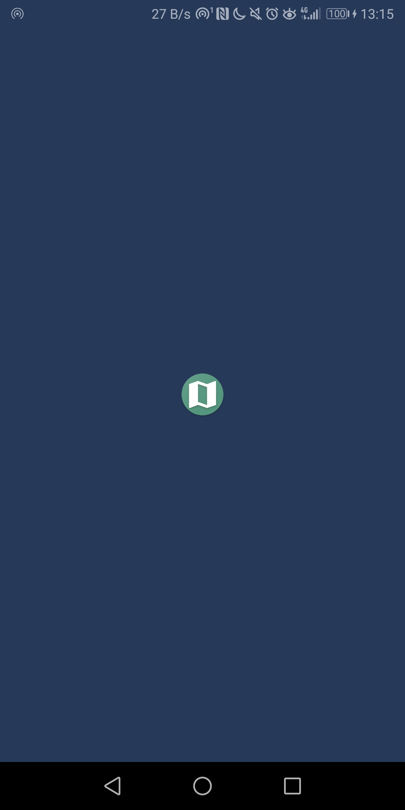
    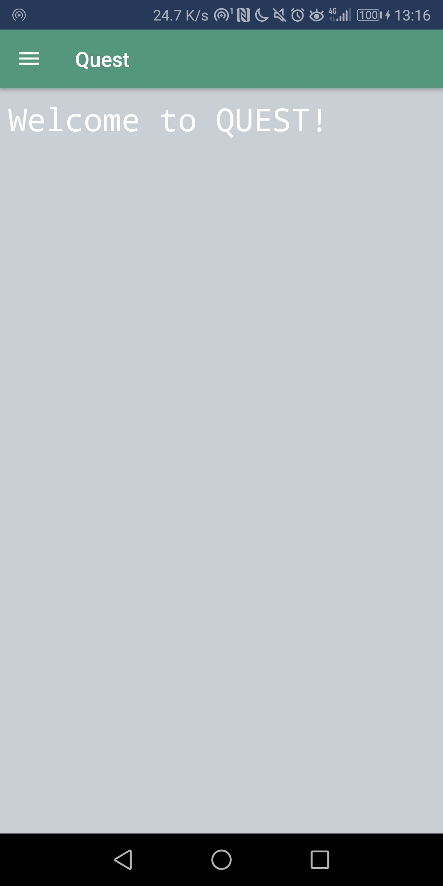
    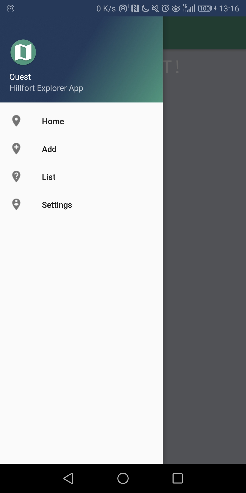
    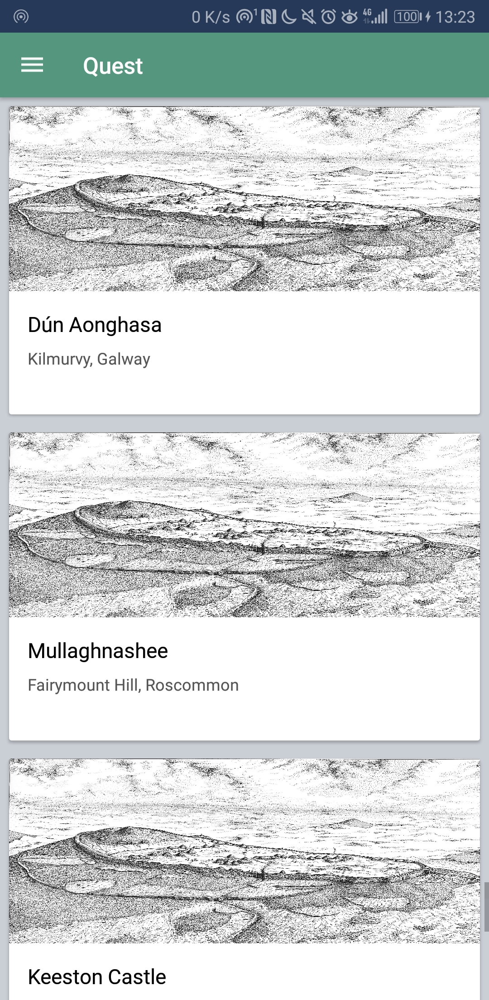
    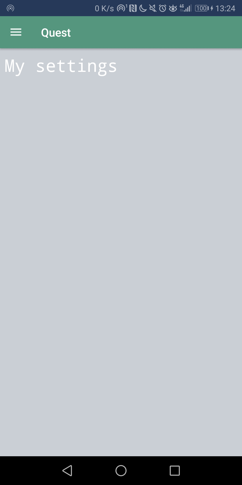

    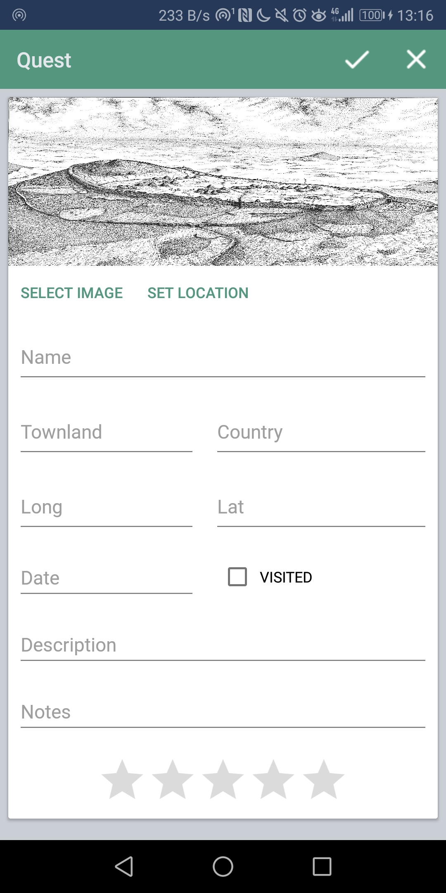
    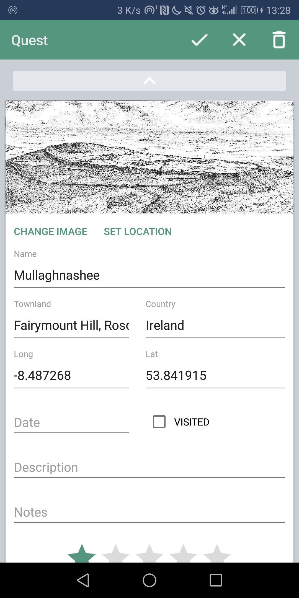
    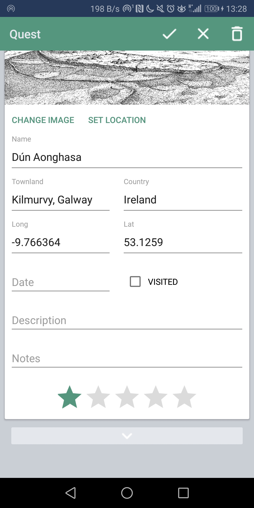
    

### v3.0
* Select up to 4 images
* Login
* Sign up
* Log out
* Users and Quests Unified JSON
* Settings: user profile and statistics

#### Additional features
* Fullscreen image mode
* Profile image
* Delete profile

    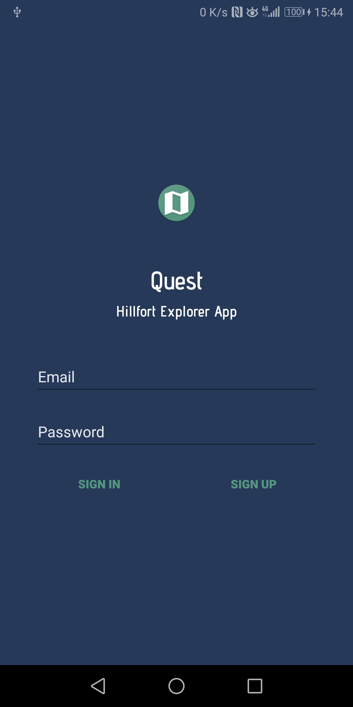
    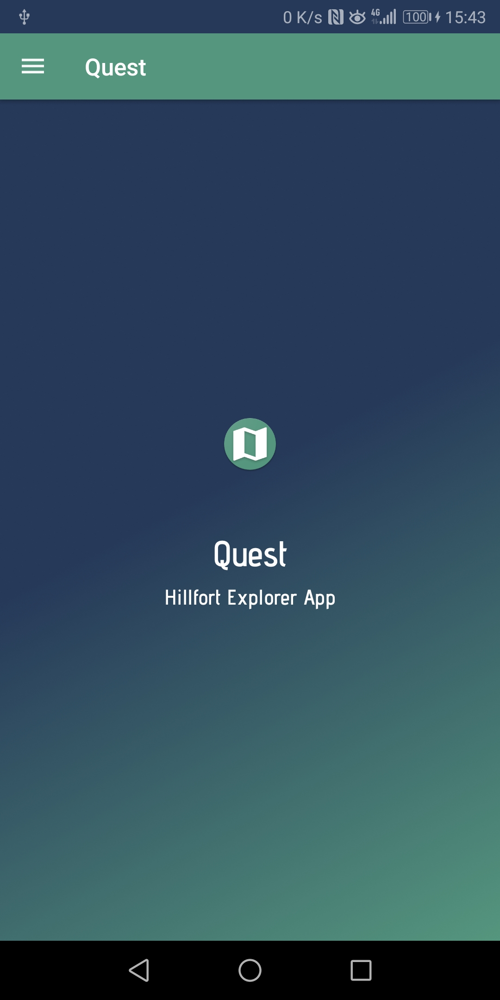
    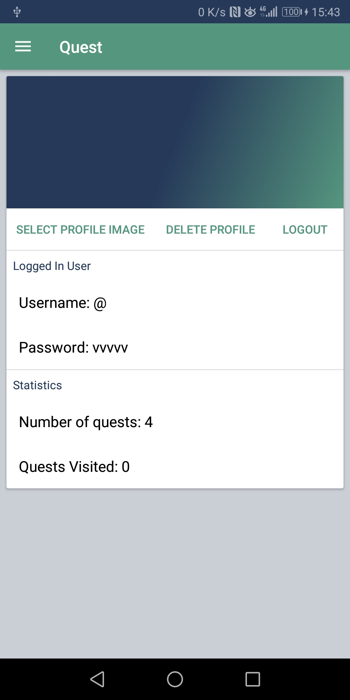
    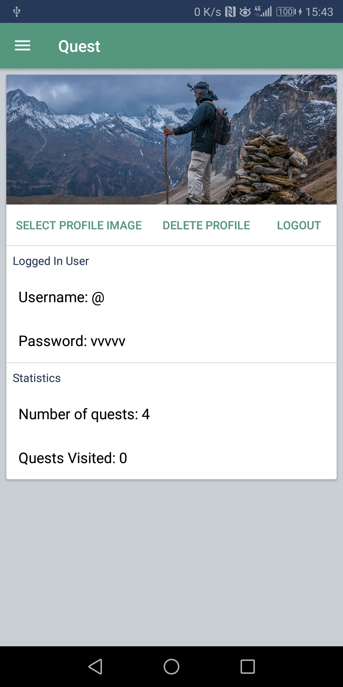
    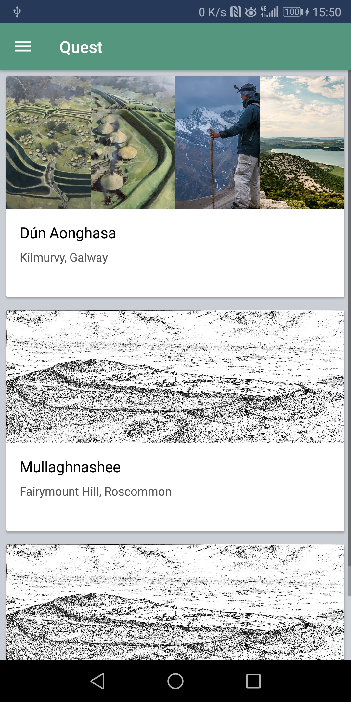

    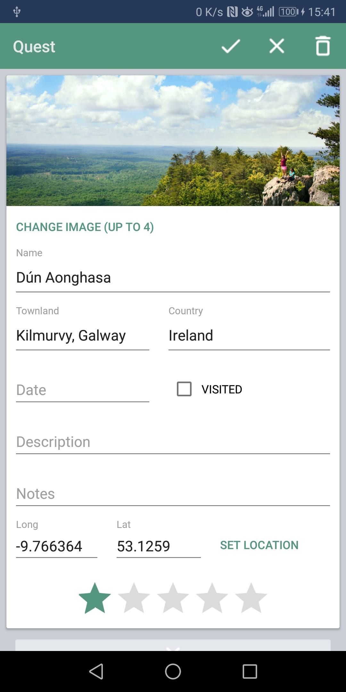
    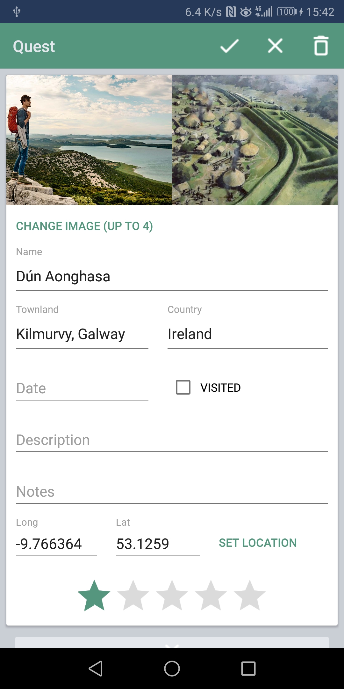
    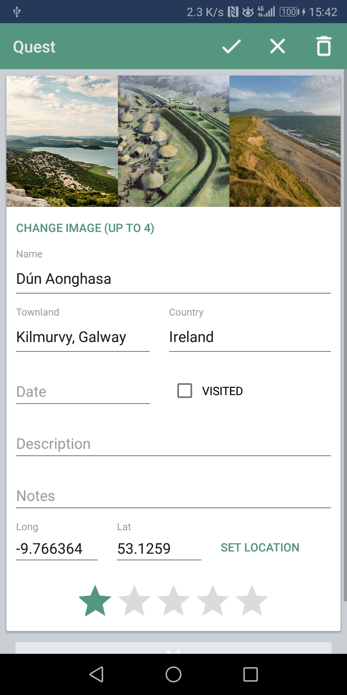
    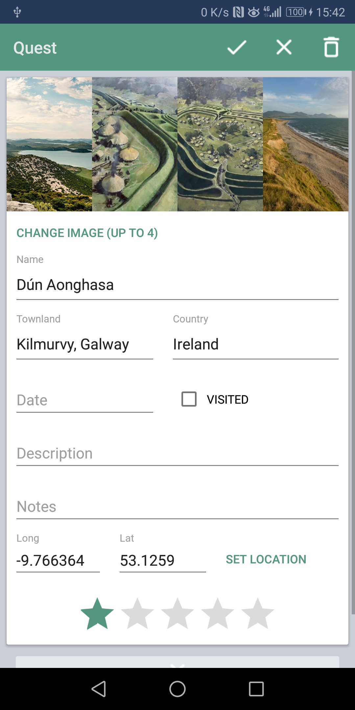
    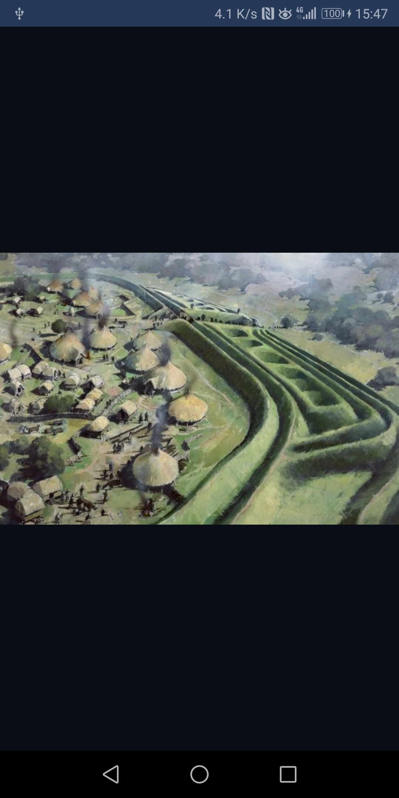

