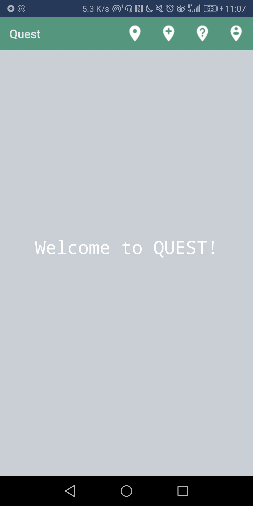
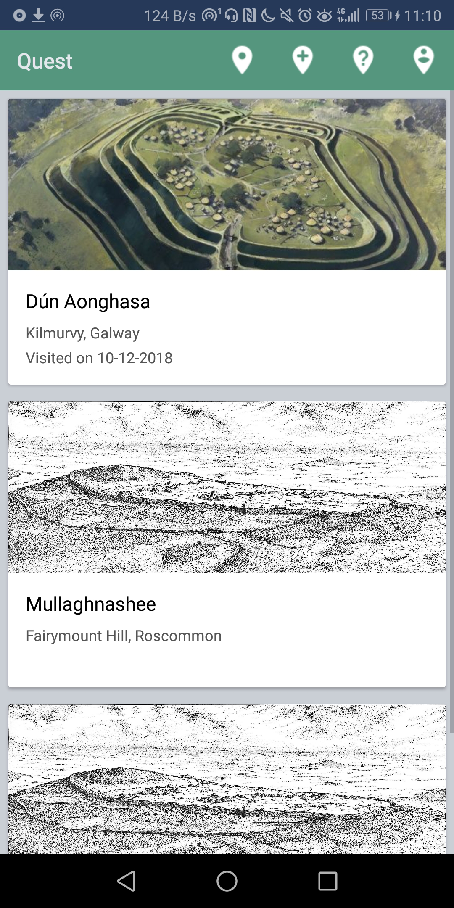
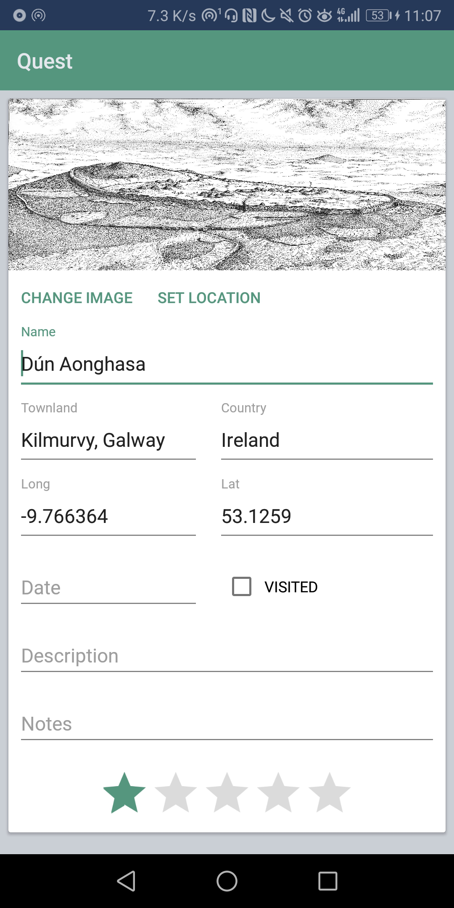
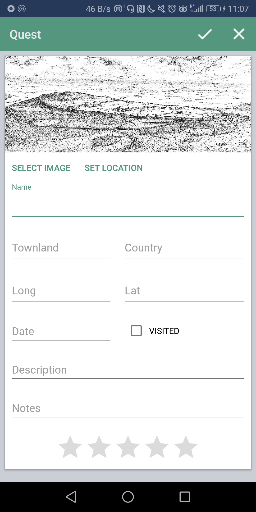
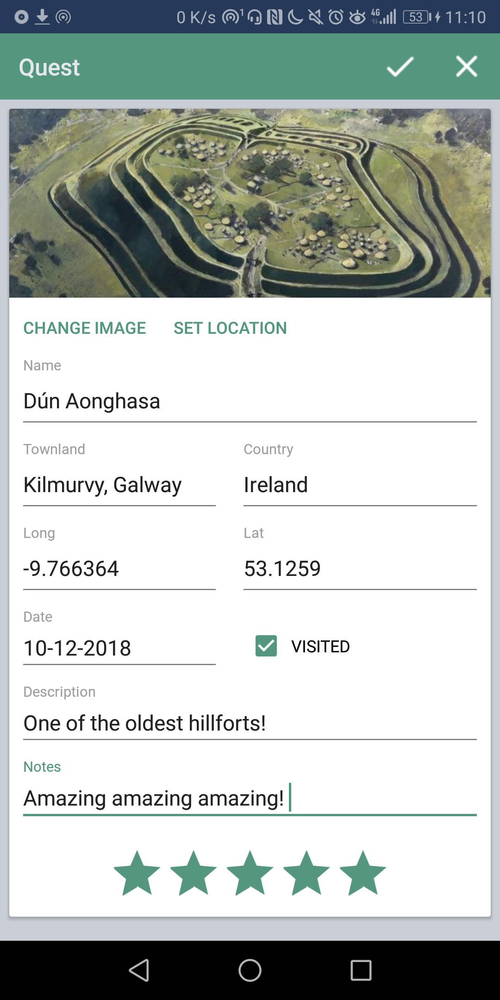

# Quest

Quest is a Hillfort Explorer App powered by Kotlin.

### Assignment Specification
* Splash Screen
* Login / Sign up / Log out
  * Email
  * Password
* Quest Create / Update / Delete 
  * Name
  * Description
  * Up to 4 images
  * Location (lat/long)
  * Visited
  * Date
  * Notes
* Quest List 
* Settings
  * Total Number of Quests
  * Number of Quests Visited
* Navigation Drawer
* Unified JSON (users, quests)
* Commit History, Tagged Releases, Branching

### v1.0
* Quest List 
* Quest Update / Create / Cancel
  * Name
  * Description
  * 1 Image
  * Location (lat/long)
  * Notes
  * Visited
  * Date
  * Rating
* Toolbar: Home, Create, List, Settings

    
    
    
    
    

